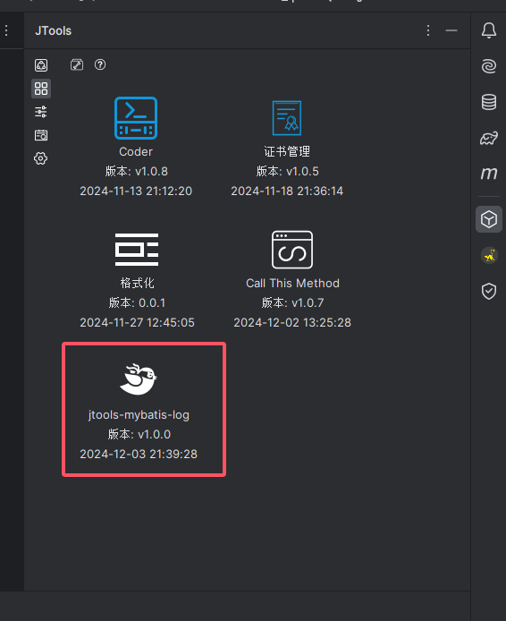
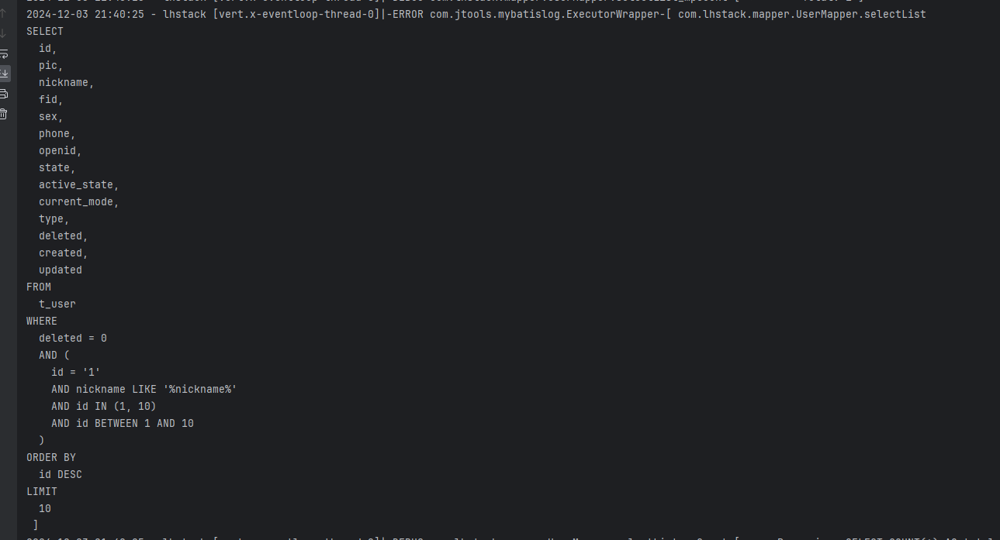
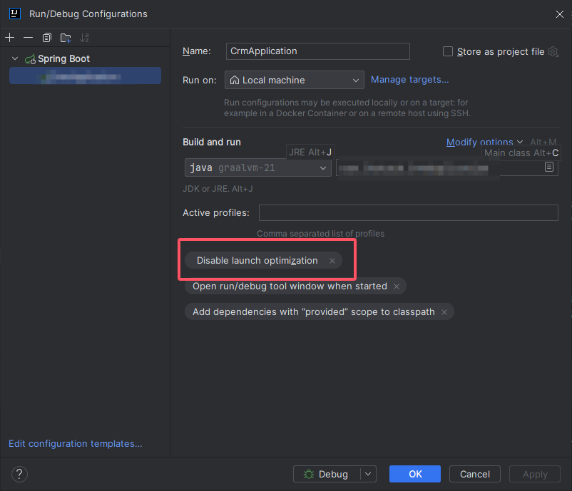

# 插件使用教程
`https://blog.csdn.net/qq_42413011/article/details/144071858`
# 在控制台输出完整的mybatis sql日志

# 如果安装了此插件,debug启动项目失败,无任何日志提示,关闭Launch optimization

# 更新日志

## v1.0.8
- fix: 修复 MyBatis-Plus 分页插件的 ORDER BY 排序参数未打印问题
- fix: 修复分页插件优化后的 count SQL 未正确显示问题
- fix: 修复 macOS/Linux 系统下配置文件路径不兼容导致的权限错误

## v1.0.9
- feat: 重构设置面板，支持表格化管理排除包
- feat: 支持通过选择类来导入库(Library)包到排除列表
- feat: 新增 SQL 格式化方言选择
- fix: 修复 Idea 2017.1 版本兼容性问题

## v1.1.0
- feat: 新增 SQL 格式化开关，关闭时将 SQL 压缩为单行输出
