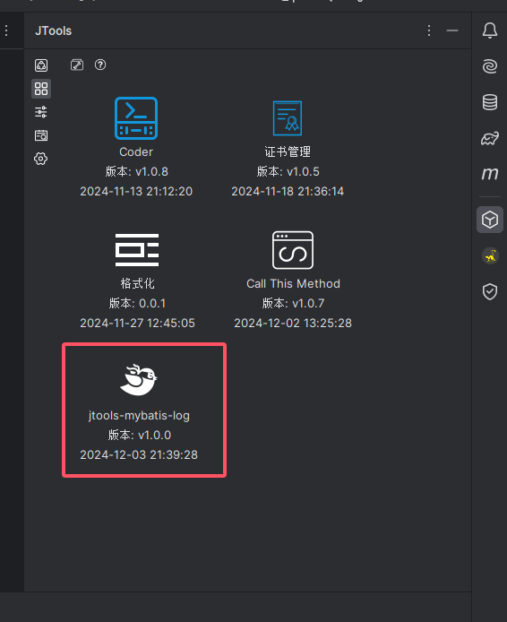
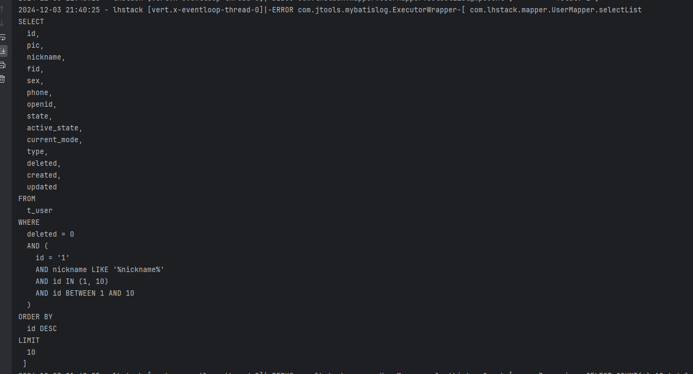
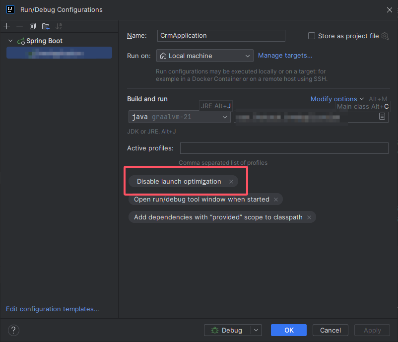

# 插件使用教程
`https://blog.csdn.net/qq_42413011/article/details/144071858`
# 在控制台输出完整的mybatis sql日志

# 如果安装了此插件,debug启动项目失败,无任何日志提示,关闭Launch optimization

# 更新日志

## v1.0.8
- fix: 修复 MyBatis-Plus 分页插件的 ORDER BY 排序参数未打印问题
- fix: 修复分页插件优化后的 count SQL 未正确显示问题
- fix: 修复 macOS/Linux 系统下配置文件路径不兼容导致的权限错误

## v1.0.9
- feat: 重构设置面板，支持表格化管理排除包
- feat: 支持通过选择类来导入库(Library)包到排除列表
- feat: 新增 SQL 格式化方言选择
- fix: 修复 Idea 2017.1 版本兼容性问题

## v1.1.0
- feat: 新增 SQL 格式化开关，关闭时将 SQL 压缩为单行输出

## v1.1.1
- fix: 修复宿主项目未引入 slf4j 时应用无法启动的问题，日志改用 MyBatis 自带的日志门面
- fix: 修复 SQL 中字符串字面量与注释内的问号被当作参数占位符，导致其后所有参数错位的问题
- fix: 修复参数值包含单引号时生成的 SQL 无法直接执行的问题
- fix: 补齐未实现的参数写入方法，避免对应参数位被错误输出为 null
- fix: 修复未引入 mybatis-plus / pagehelper 的项目每条 SQL 都触发类加载异常的问题
- fix: 修复排除包配置手工编辑后含空格导致规则失效的问题
- fix: 修复配置文件写入失败被静默忽略的问题，改为向用户提示
- fix: 修复设置面板未做改动时 Apply 按钮仍被点亮的问题
- perf: 被排除的包不再生成和格式化 SQL
- chore: 兼容版本上限提升至 265.*

## v1.1.2
- fix: 修复同一 JVM 挂载多份本 agent 时重复增强导致 ClassFormatError、应用无法启动的问题
- fix: 修复 mybatis-plus BaseMapper 分页查询的 LIMIT 与 ORDER BY 未打印的问题，分页参数改为按值识别，不再依赖参数键名
